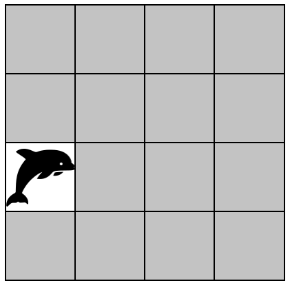
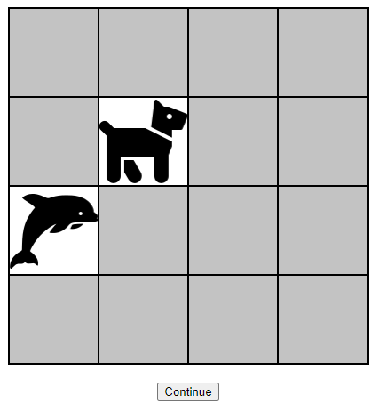

This is a simple matching game that I made using HTML, CSS and JavaScript. The game is a 4x4 table with 8 image pairs, each image randomly positioned. The images are randomly shuffled every time the page is loaded. The game is implemented using the jQuery library. The game is played by clicking on a tile to reveal the image underneath. The player then clicks on another tile to reveal the image underneath. If the two images match, the tiles are disable from the board. If the two images do not match, continue button is appeared just below the bottom of board, and upon clicking the button, the tiles are turned face down again. The game is won when all the tiles are disabled from the board.

